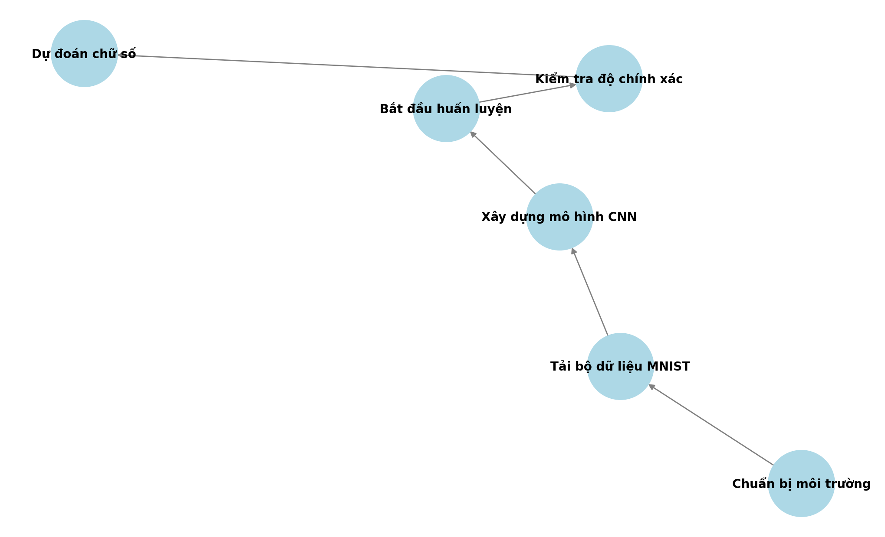
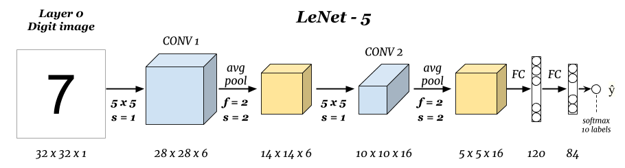

<h1 align="center">PHÁT TRIỂN MÔ HÌNH CNN ĐỂ NHẬN DIỆN CHỮ VIẾT TAY TRÊN BỘ DỮ LIỆU MNIST</h1>

  
    

<h2 align="center">Phát triển mô hình CNN để nhận diện chữ viết tay trên dataset Mnist</h2>

Phát triển mô hình CNN để nhận diện chữ viết tay trên MNIST là ứng dụng AI trong xử lý ảnh, giúp phân loại chữ số viết tay một cách chính xác. CNN tự động trích xuất đặc trưng từ ảnh, nâng cao hiệu suất nhận diện so với các phương pháp truyền thống. Công nghệ này hỗ trợ số hóa tài liệu, nhận diện chữ viết và ứng dụng trong nhiều lĩnh vực như giáo dục, ngân hàng, và tự động hóa.

---

## 🌟 Giới thiệu
Huấn luyện mô hình CNN để nhận biết các số từ 0-9
---
## 🏗️ HỆ THỐNG

  

---

## 🛠️ CÔNG NGHỆ SỬ DỤNG

  

##  Yêu cầu hệ thống

Yêu cầu phần cứng
Bộ xử lý (CPU/GPU):
CPU: Intel Core i5 hoặc cao hơn
GPU: NVIDIA GTX 1050 trở lên (khuyến nghị dùng GPU để tăng tốc huấn luyện)
RAM: Tối thiểu 8GB (khuyến nghị 16GB để xử lý dữ liệu nhanh hơn)
Bộ nhớ lưu trữ: Ít nhất 5GB trống để lưu trữ tập dữ liệu MNIST và kết quả huấn luyện
Môi trường phát triển: Máy tính cài đặt Python, Jupyter Notebook/Google Colab hoặc VS Code
2. Yêu cầu phần mềm
Hệ điều hành: Windows, Linux hoặc macOS
Thư viện Python cần thiết:
torch, torchvision, numpy, matplotlib, opencv, pandas
Môi trường ảo hóa (nếu cần): Anaconda hoặc Virtualenv để quản lý thư viện dễ dàng
3. Yêu cầu dữ liệu
Nguồn dữ liệu: Bộ dữ liệu MNIST

## 🚀 Hướng dẫn cài đặt và chạy

 <h2>Bước 1:  Cài đặt môi trường</h2>
    <h2>Bước 2: Tải bộ dữ liệu MNIST</h2>
   
  ## Bước 3: Xây dựng mô hình CNN
   
  ## Bước 4:Cấu hình huấn luyện 
   
  ## Bước 5:  Huấn luyện mô hình

  ## Bước 6: Đánh giá mô hình trên tập test
  ## Bước 7: Dự đoán chữ số từ ảnh mới
  ## Bước 8: Lưu và tải lại mô hình
   
   

## 🤝 Đóng góp
Dự án được phát triển bởi 3 thành viên:

| Họ và Tên                | Vai trò                  |
|--------------------------|--------------------------|
| Nguyễn Mạnh Quyết             | Phát triển toàn bộ mã nguồn,Powerpoint, thuyết trình, đề xuất cải tiến.|
| Kiều Duy Vinh            | Overleaf,hỗ trợ bài tập lớn.|
| Vũ Việt Quang    | Hỗ trợ bài tập lớn.  |

© 2025 NHÓM 4, CNTT 17-15, TRƯỜNG ĐẠI HỌC ĐẠI NAM
